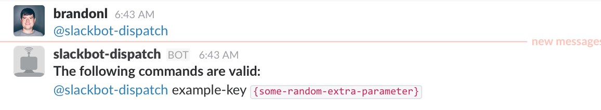
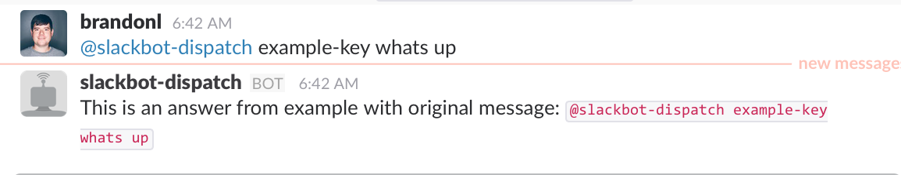
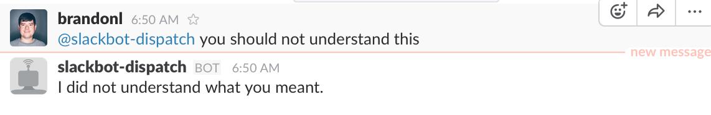

# Slack Bot Dispatch

> Helping organize code for slackbots to quickly add functionality

The idea with this codebase is to provide a small framework for adding "strategies" to a slackbot.  Think of a strategy like a question, answer pair.

Hopefully, with this framework, you will only have to code new **strategies** instead of worrying about running a slackbot.

## Installing and Running
Literally, install the npm package and run `npm start`.  An example strategy will be installed as well.
> Note: there are 2 environment variables that need to be set
> * BOT_NAME
> * BOT_API_KEY

```
 $ export BOT_API_KEY=xyz
 $ export BOT_NAME=leeeroyjenkins
 $ npm install slackbot-dispatch
 $ npm start
```
> Note: log4js is used to log certain events, set **LOG_LEVEL** environment variable to change output

-------
## Usages
Once the slackbot is running, you can ask questions.

### Show Usages


### Valid Strategy


### Invalid Strategy


-------
## Strategies explained
The idea is that there is a directory of strategies that are the interface to your slackbot's functionality.  Each strategy has a way of determining if it can handle the current messaging coming in, and returning the output for that message or request from a user.
The strategy manager loops through the directory of strategies, defaulted to `lib/strategies`, and uses those throughout the life of the slackbot.

Every message coming in is examined to determine if it meets the following criteria.  If so, it is sent to the dispatcher to determine if any of the strategies can handle the current message.
* Does the message mention the slackbot?
* Is the user _not_ the slackbot?
* Is the message in a Channel or Group?
* Is the message an actual "chat" message (slack sends lots of messages like files being uploaded, users joining a channel, etc)

## Implementing a new strategy
The idea is that one creates a class that implements the `BotStrategyBase` class.  By putting the strategy into the `lib/strategies` folder, the strategy should be included on startup.  Everything else should just work.  There is an example in the `lib/strategies` directory.
> There is an example copied into the target folder on install.

[Example strategy](lib/strategies/example-strategy.js)

### Methods

#### getKeys
Returns the messages that a single strategy will respond to. The key is how a user tells the slackbot which question in which to give an answer

| Method Name | Params | Result | Description |
| --- | --- | --- | --- |
| **getKeys** | none | `string[]` | Returns the messages that a single strategy will respond to. The key is how a user tells the slackbot which question in which to give an answer |
| **getUsage** | none | `string[]` | The usage method helps to tell the users of the slackbot how to format their questions.|
| **canHandle** | `message` | `boolean` | Has a default implementation to try to match part of the incoming message to the current keys.  To change the behavior, implement in the strategy to override the base functionality. |
| **handle** | `message` | `string` | Returns the message that the slackbot will respond with. Should be implemented to return a Promise that resolves a string. |

#### Message example
```
{
  type: 'message',
  channel: 'ABCDEFG',
  user: 'U0D98DJS',
  text: '<@U04L00> example-key whats up',
  ts: '1475840569.000306',
  team: 'T0293DLD8',
  isChannel: false,
  isGroup: true,
  changedText: 'example-key whats up'
}
```
> Note: `changedText` is `text` with the **userId** replaced from the beginning

## Customization

#### Strategy Directory
By default, the bot will look for strategies in the `lib/strategies` dir.  To change this, set the `SLACK_STRATEGY_DIR` environment variable to a filepath.

#### Logging
[Log4js](http://stritti.github.io/log4js/) is used for logging.  Set the `LOG_LEVEL` to the desired level for output.